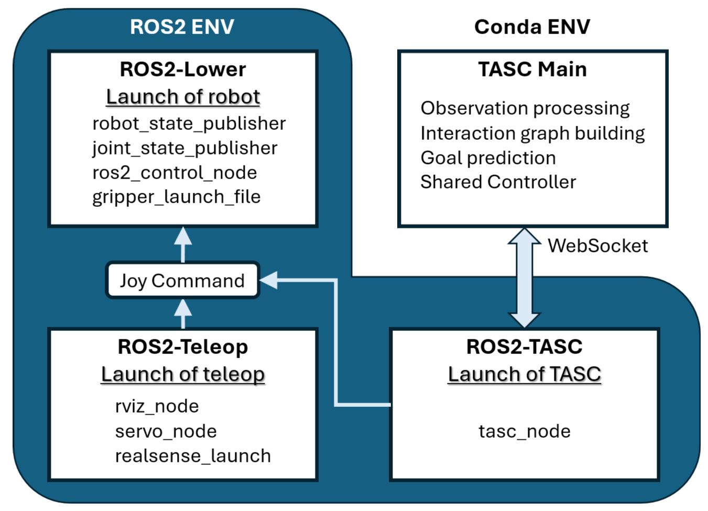

# tasc_ros2_ws
A ROS2 package for running TASC on franka_fr3 robot in real world.

## Prerequisites
1. Ubuntu with [ROS2 Humble](https://docs.ros.org/en/humble/index.html)
2. Franka related libraries, see [franka_ros2](https://github.com/frankarobotics/franka_ros2)
3. [colcon tools](https://ros2docs.robook.org/humble/Tutorials/Beginner-Client-Libraries/Colcon-Tutorial.html) (optional but recommended)
4. Realsense ROS2 packages, see [realsense-ros](https://github.com/IntelRealSense/realsense-ros) (optional, depending on your camera)

## Installation
Clone this repository and compile the workspace:
```
git clone https://github.com/fitz0401/tasc_ros2_ws.git
cd tasc_ros2_ws
colcon build
```
Source the workspace:
```
source ./install/setup.bash
```

## Usage


1. Bring up the robot:
```
ros2 launch franka_fr3_moveit_config lower.launch.py robot_ip:=172.16.0.2
```

2. Start teleoperation with a joystick:
```
ros2 launch moveit_servo teleop.launch.py
```

3. Launch the TASC node:
```
ros2 launch tasc_bringip tasc.launch.py
```

4. Now the WebSocket is ready to listen for shared control commands from the TASC main logic. Open a new terminal (can be on a different computer within the same LAN) activate the Conda environment, and run:
```
conda activate tasc
python tasc/tasc_real_world.py
```

## Calibration Guide
Our experimental platform includes an global camera. Here are the recommended calibration steps.
1. Follow [franka_handeye_calibration_ros2](https://github.com/ChengYaofeng/franka_handeye_calibration_ros2), prepare an aruco marker, and set up the `calib_ws`
2. Perform the calibration, then update the TF transformation (`tf1`, which is `fr3_link0 → camera_optical_link`) in `src/moveit_servo/launch/teleop.launch.py`
3. Fetch Camera Intrinsics. These can usually be obtained via the camera API. Update the TF transformation (`tf2`, which is `camera_optical_link → camera_link`) in `src/moveit_servo/launch/teleop.launch.py`